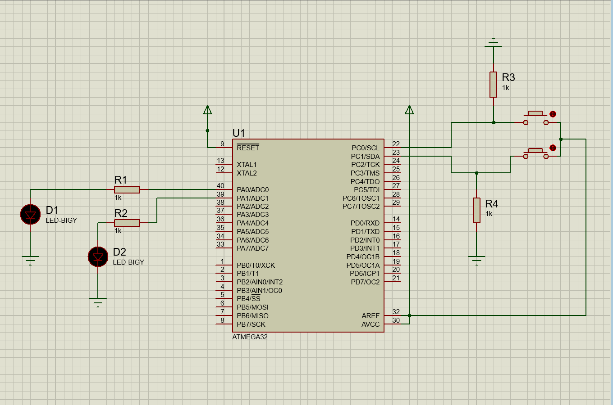

# Industrial Control Systems Security Project  
**Transilvania University of Brașov (UNITBV)**  
*Master's Program - Year 1, Semester 2*  
*Implemented in Proteus 8 Professional*



## Project Overview
A secure embedded control system implementing hardware security verification with real-time task scheduling. The system demonstrates industrial security principles through:

- **Real-time OS** with multi-rate cyclic scheduling (5ms-500ms)
- **Hardware security monitor** (RIPEMD-160 verification)
- **Secure I/O control** with state validation
- **Defensive programming** patterns for critical systems

## Project Structure
```
project
├── main.c              # Main application entry point
├── os.[c|h]            # Operating system core
├── application.[c|h]   # Business logic layer
├── led_drv.[c|h]       # LED driver (PA0-PA1)
├── btn_drv.[c|h]       # Button driver
├── cysec_drv.[c|h]     # Cryptographic security module
├── docs/
│   ├── application.md  # Application documentation
│   ├── os.md           # OS specifications
│   ├── btn_drv.md      # Button interface
│   ├── cysec_drv.md    # Security protocol
│   └── led_drv.md      # LED driver API
└── README.md
```

## Key Components

### 1. Operating System (`os.[c|h]`)
- 5-tier scheduler (5ms/10ms/50ms/100ms/500ms cycles)
- Timer0-based interrupt driver
- System initialization sequence
- *See full documentation:* [docs/os.md](docs/os.md)

### 2. Application Logic (`application.[c|h]`)
- State machine for LED-button interaction
- Security state validation
- Event-driven control flow
- *See full documentation:* [docs/application.md](docs/application.md)

### 3. Hardware Drivers
| Driver | Purpose | Documentation |
|--------|---------|---------------|
| `led_drv` | LED control (on/off/toggle) | [docs/led_drv.md](docs/led_drv.md) |
| `btn_drv` | Debounced button input | [docs/btn_drv.md](docs/btn_drv.md) |
| `cysec_drv` | Firmware integrity check | [docs/cysec_drv.md](docs/cysec_drv.md) |

## Development Setup
```bash
# Build commands
avr-gcc -mmcu=atmega328p -Os *.c -o firmware.elf
avr-objcopy -O ihex firmware.elf firmware.hex
```

# Proteus Simulation:
1. Load "Industrial_Security.pdsprj"
2. Program ATmega328P with firmware.hex
3. Start simulation (Ctrl+B)
