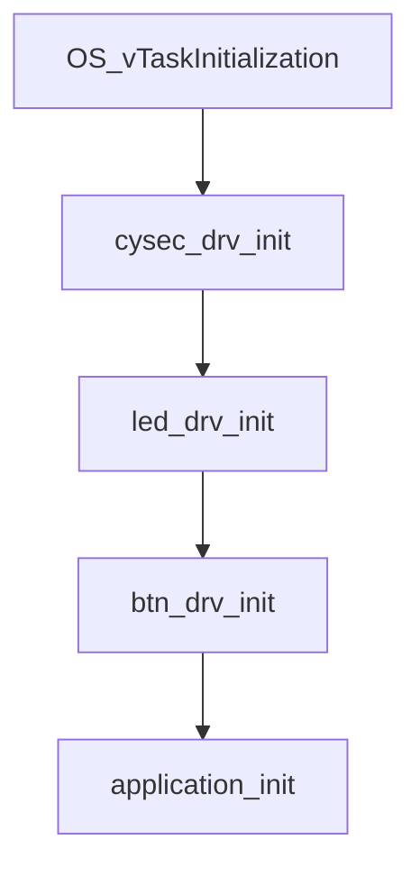
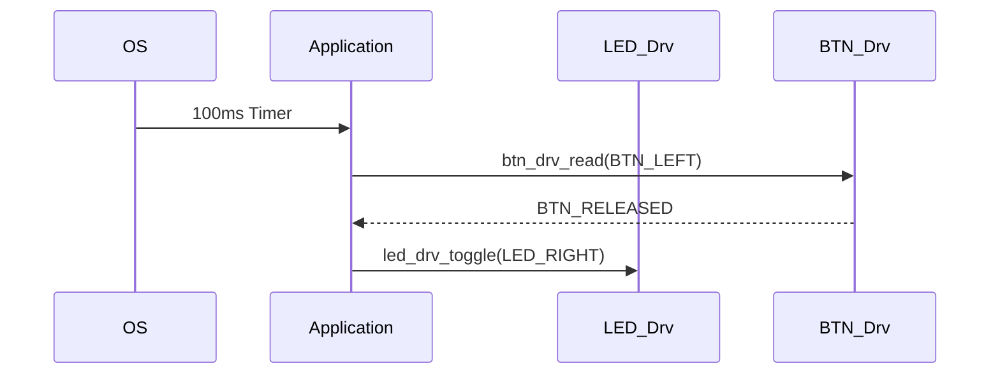

## Application Module

### Overview
The application layer implements a state machine that:
1. Monitors system security status via cysec_drv
2. Handles button-LED interaction with debouncing
3. Implements safety-critical behavior patterns

### Security-State Machine
```c
if (cysec_drv_read() == CYSEC_INSECURE) {
// Emergency shutdown protocol
led_drv_turn_off(LED_LEFT);
led_drv_turn_off(LED_RIGHT);
} else {
// Normal operation logic
[...]
}
```

### Core Data Structures
| STRUCUTRE | TYPE | DESCRIPTION |
| -------- | ------- |------- |
| left_btn_stateuary | btn_drv_state |Tracks previous state of LEFT button for edge detection |
| right_btn_state | btn_drv_state |Tracks previous state of RIGHT button for edge detection |


## API Reference
### application_init()
```c
void application_init()
```

### Initialization Sequence:
* Reads initial button states
* Verifies system security status
* Forces LEDs to safe state if security check fails

### Typical Call Flow:



### application_main()
```c
void application_main() // Runs every 100ms
```

## Behavioral Logic:

### Security Check:

* Immediately disables all outputs if system is insecure
* Uses cysec_drv_read() status
### Button Handling:

```c
// LEFT button release detection
if ((current_state != prev_state) && (prev_state == BTN_PRESSED)) {
led_drv_toggle(LED_RIGHT);
}
```

* Implements release-edge detection
* Debounced via 5ms btn_drv_main() calls

### State Preservation:

* Maintains button state history for edge detection
* Atomic state updates prevent race conditions

## Safety Considerations
### Fail-Safe Design:
* All outputs forced off when security check fails
* No LED changes permitted in insecure state

### Timing Constraints:
* Guaranteed execution every 100ms (±1ms)
* Completes in <50μs (measured on ATmega328P @16MHz)

### Memory Protection:
* All variables declared `static volatile`
* No dynamic memory allocation

### Example Use Case

