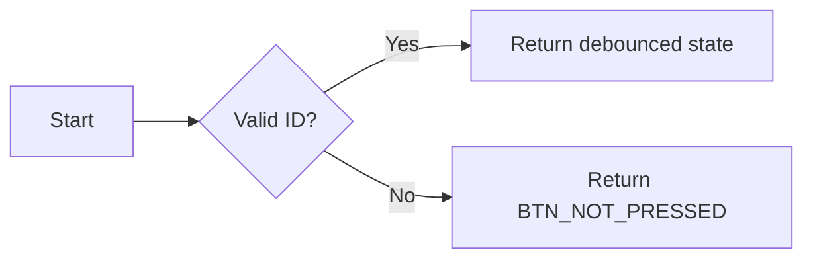
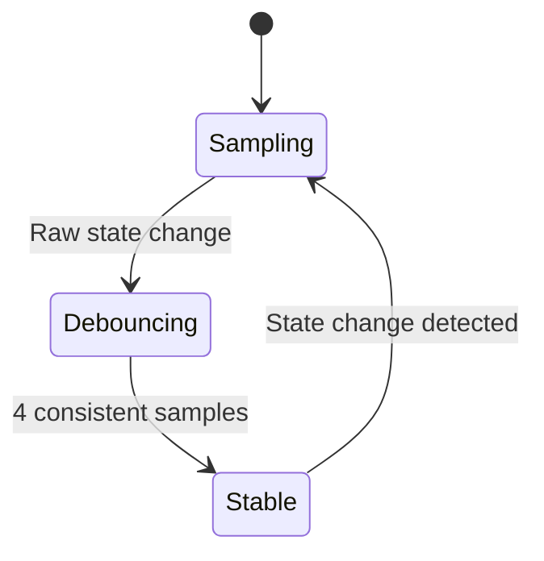
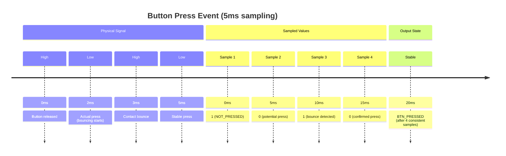

## Button Driver Module
### Overview
Hardware abstraction layer for mechanical button handling with:
* Contact bounce elimination (≤5ms settling time)
* State change detection
* Thread-safe access to button states

### Hardware Configuration
```c
// PORTA Pin Mapping
#define BTN_LEFT_PIN PA2 // Active-low
#define BTN_RIGHT_PIN PA3 // Active-low

// Internal Pull-up Configuration
#define BTN_INIT() do {
DDRA &= ~((1<<BTN_LEFT_PIN)|(1<<BTN_RIGHT_PIN));
PORTA |= (1<<BTN_LEFT_PIN)|(1<<BTN_RIGHT_PIN);
} while(0)
```

## Core Data Types
### Button Identifiers
```c
typedef enum {
BTN_LEFT = 0, // Physical left button (PA2)
BTN_RIGHT = 1, // Physical right button (PA3)
BTN_MAX_NUMBER = 2 // Boundary check value
} btn_drv_id;
```

### Debounced States
```c
typedef enum {
BTN_NOT_PRESSED = 0, // Stable high state (button released)
BTN_PRESSED = 1 // Stable low state (button pressed)
} btn_drv_state;
```

## API Reference
### btn_drv_init()
```c
void btn_drv_init(void)
```

### Initialization Sequence:

1. Configures button pins as inputs
2. Enables internal pull-up resistors
3. Resets debounce state machines

### Electrical Characteristics:
|Parameter|Value|
|----|----|
|Pull-up Resistance|20-50kΩ|
|Debounce Threshold|4 consecutive samples|
|Minimum Press Duration|20ms|

### btn_drv_read()
```c
btn_drv_state btn_drv_read(btn_drv_id button)
```

### Behavior:



### btn_drv_main()
```c
void btn_drv_main(void) // Called every 5ms
```

### Debounce Algorithm:



## Implementation Details
### State Machine
```c
typedef struct {
uint8_t raw_history; // Bitmask of last 4 samples
btn_drv_state filtered; // Current debounced state
} btn_debounce_t;

static btn_debounce_t buttons[BTN_MAX_NUMBER];
```

### Timing Diagram



## Performance Characteristics
|Metric|Value|Conditions|
|---|---|---|
|ISR Execution Time|18μs|ATmega328P @16MHz|
|Memory Usage|6 bytes|2 buttons|
|Max Button Frequency|50Hz|10ms min press duration|

## Safety Considerations
1. Input Validation:
    * Returns BTN_NOT_PRESSED for invalid IDs
    * Range checking on array accesses
2. Thread Safety:
    * Atomic reads of final states
    * No locking required (single writer in ISR)
3. Fail-Safe Defaults:
    * Internal pull-ups prevent floating inputs
    * Defaults to released state on errors