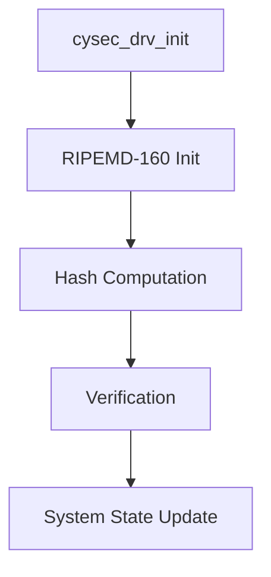
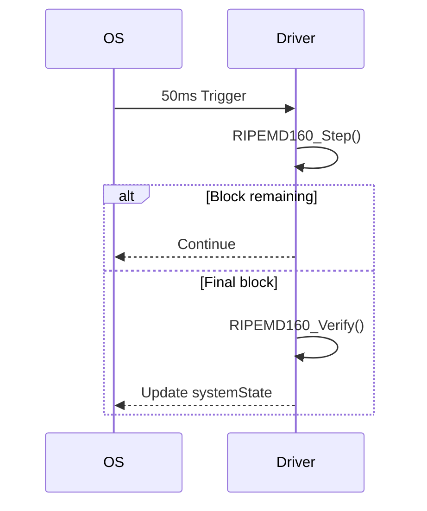

## Cryptographic Security Driver (cysec_drv)
### Overview
Hardware security module implementing RIPEMD-160 hash verification for firmware integrity checking. Provides real-time security state monitoring through cyclic hash verification of program memory.

### Key Features
* Memory Integrity Checking : Continuous RIPEMD-160 verification of 2KB firmware space
* Secure State Management : Global security state machine
* Optimized Implementation : In-place processing with minimal memory footprint
* Fail-Safe Operation : Automatic system lockdown on verification failure

### Architecture



## Data Structures
### Security State

```c
typedef enum {
    CYSEC_SECURE = 0, // Firmware verification passed
    CYSEC_INSECURE = 1 // Verification failed or in progress
} cysec_drv_state;
```

### RIPEMD-160 Context
```c
typedef struct {
    const uint8_t *message; // Pointer to firmware memory (0x2000)
    size_t msgLen; // Fixed 2048-byte block
    uint64_t bitLen; // Message length in bits
    size_t paddedLen; // Total padded length
    size_t blkOffset; // Current processing offset
    uint32_t h0,h1,h2,h3,h4; // Hash state variables
} RIPEMD160_CTX;
```

## API Reference
### cysec_drv_init()

```c
void cysec_drv_init(void)
```

### Initialization Sequence:

* Sets up RIPEMD-160 context for 2KB firmware area (0x2000–0x27FF)
* Performs full initial hash verification
* Sets global security state

### Memory Map:

|Address range|Content|
|---|---|
|`0x2000–0x27FF`|Firmware verification area|
|`0x0000–0x1FFF`|Protected bootloader|

### cysec_drv_read()
```c
cysec_drv_state cysec_drv_read(void)
```

### Return Values:

* `CYSEC_SECURE`: Firmware hash matches golden value
* `CYSEC_INSECURE`: Verification failed or in progress

### cysec_drv_main()

```c
void cysec_drv_main(void) // Called every 50ms
```

Operational Flow:



### Algorithm Implementation
## RIPEMD-160 Process


## Key Constants
```c
// Golden hash value (expected result)
static uint8_t GOOD_HASH[20] = {0x9A,0xAD,0x4D,0xB9,...};

// Rotation constants
static const uint8_t r_left[80] = {...};
static const uint8_t r_right[80] = {...};
```

## Performance Characteristics
|Metric|Value|Conditions|
|---|---|---|
|Processing Speed|320μs/block|ATmega32 @16MHz|
|Memory Usage|120 bytes RAM|Includes context|
|Code Size|1.8KB Flash|Optimized for -Os|
|Verification Time|65ms|Full 2KB via 50ms chunks|

### Safety Considerations
## Memory Protection:
* All sensitive data marked `static const`
* Program memory access via `pgm_read_byte()`
## Timing Security:
* Constant-time hash comparison
* No early termination on mismatch
## State Integrity:
* `volatile systemState` variable
* Atomic state transitions

### Example Usage
```c
// System initialization
void OS_vTaskInitialization(void) {
cysec_drv_init(); // First component to initialize
// ...other initializations
}

// Runtime check
if (cysec_drv_read() == CYSEC_INSECURE) {
// Enter lockdown mode
}
```