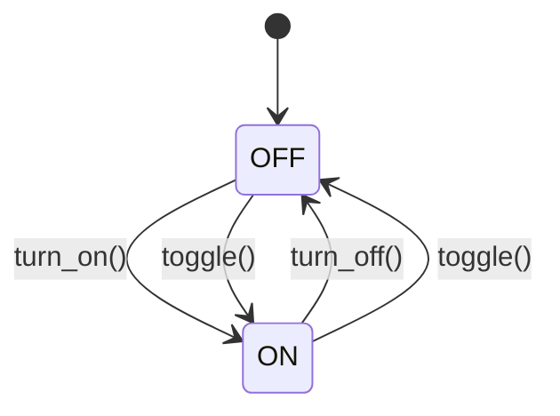
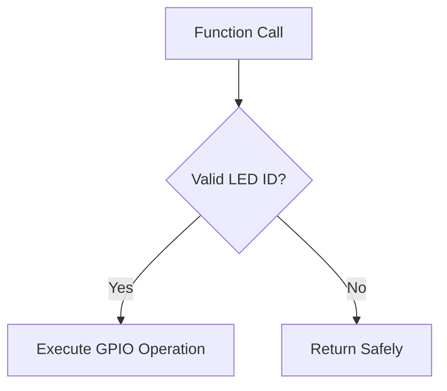

## LED Driver Module
### Overview
Hardware abstraction layer for LED control with:
* Atomic GPIO operations
* Runtime state validation
* Power management safeguards

### Hardware Configuration
```c
// PORTA Pin Mapping
#define LED_LEFT_PIN PA0 // Active-high
#define LED_RIGHT_PIN PA1 // Active-high

// LED Initialization Macro
#define LED_INIT() do {
    DDRA |= (1<<LED_LEFT_PIN)|(1<<LED_RIGHT_PIN);
    PORTA &= ~((1<<LED_LEFT_PIN)|(1<<LED_RIGHT_PIN));
} while(0)
```

## Core Data Types
### LED Identifiers
```c
typedef enum {
    LED_LEFT = 0, // Left indicator (PA0)
    LED_RIGHT = 1, // Right indicator (PA1)
    LED_MAX_NUMBER = 2 // Boundary check value
} led_drv_id;
```

## API Reference
### led_drv_init()
```c
void led_drv_init(void)
```

### Initialization Sequence:
* Configures LED pins as outputs
* Forces all LEDs to OFF state
* Sets up power-saving defaults

### Electrical Characteristics:

|Parameter|Value|
|----|----|
|Drive Current|10mA per LED|
|Voltage Drop|1.8V (typical)|
|Maximum Switching Frequency|1MHz|

## Control Functions
```c
void led_drv_turn_on(led_drv_id led);
void led_drv_turn_off(led_drv_id led);
void led_drv_toggle(led_drv_id led);
```

### State Transition Diagram:



## Implementation Details
### GPIO Control Logic
```c
// Atomic pin manipulation
#define LED_SET(port, pin) ((port) |= (1<<(pin)))
#define LED_CLR(port, pin) ( (port) &= ~(1<<(pin)))
#define LED_TGL(port, pin) (*(port) ^= (1<<(pin)))
```

### Runtime Validation



### Performance Characteristics

|Metric|Value|Conditions|
|----|----|----|
|Function Latency|0.5μs|ATmega32 @16MHz|
|ISR Safety|Fully reentrant|No shared state|
|Code Size|42 bytes|Optimized for -Os|

### Safety Features
1. Input Validation:
    * Silent failure on invalid LED IDs
    * Range checking before GPIO access
2. Power Protection:
    * Defaults to low-power OFF state
    * No floating outputs during initialization
3. Thread Safety:
    * Atomic bit operations
    * No critical sections required

### Example Usage
```c
// Blink pattern generator
void blink_led(led_drv_id led, uint8_t count) {
    for(uint8_t i=0; i<count; i++) {
        led_drv_toggle(led);
        _delay_ms(250);
    }
}
```