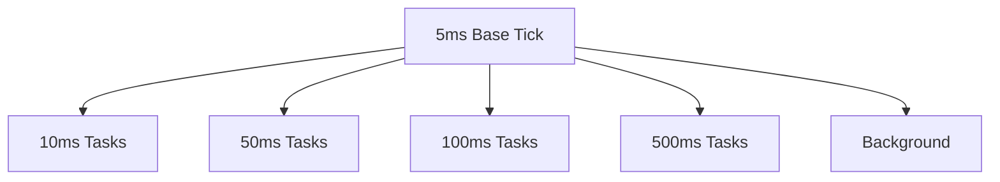
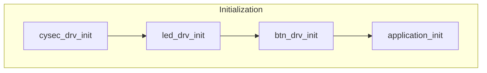
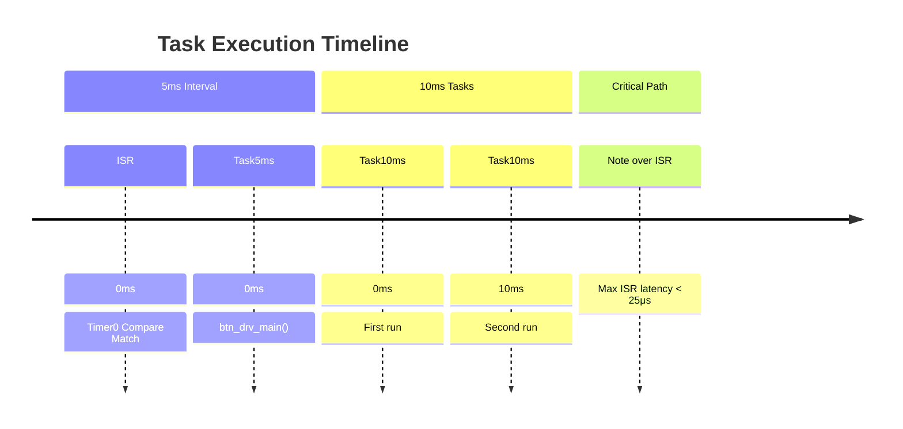

## Operating System Module
### Overview
Real-time scheduler for AVR microcontrollers featuring:
* Multi-rate task scheduling (5ms to 500ms)
* Timer-based preemptive scheduling
* Hardware abstraction layer initialization
* Background task management

### Hardware Configuration
```c
// Timer0 CTC Mode Configuration (5ms @ 16MHz)
#define TIMER0_PRESCALER (1<<CS02) // clk/256
#define TIMER0_OCR_VALUE 0x9C // 156 counts
#define TIMER0_INTERRUPT (1<<OCIE0) // Output Compare Match

// System Clock Configuration
#define F_CPU 16000000UL // 16MHz crystal
```

## Core Architecture
### Task Scheduling Hierarchy



## API Reference
### OS_vTaskInitialization()

```c
void OS_vTaskInitialization(void)
```

### Initialization Sequence:

* Security subsystem (cysec_drv)
* Peripheral drivers (led_drv, btn_drv)
* Application layer
* System status flags

### Call Graph:



### OS_vTimerInit()

```c
void OS_vTimerInit(void)
```

### Timer Configuration:

|Register|Value|Purpose|
|---|---|---|
|TCCR0|`(1<<WGM01)`|`(1<<CS02)`|
|OCR0|0x9C|5ms period|
|TIMSK|`(1<<OCIE0)`|Interrupt enable|

### Cyclic Tasks

|Fucntion|Period|Typical Usage|
|---|---|---|
|OS_vCyclicTask5ms()|5ms|Button debouncing|
|OS_vCyclicTask10ms()|10ms|Sensor polling|
|OS_vCyclicTask50ms()|50ms|Security checks|
|OS_vCyclicTask100ms()|100ms|Application logic|
|OS_vCyclicTask500ms()|500ms|System diagnostics|

## Implementation Details
### Timing Diagram



### Memory Footprint
|Component|Size (bytes)|
|---|---|
|Scheduler Core|148|
|Task Control Blocks|12|
|ISR Stack Frame|8|

### Performance Characteristics
|Metric|Value|Conditions|
|---|---|---|
|Timer Resolution|5ms ±0.1%|16MHz crystal|
|ISR Latency|2.5μs|No nested interrupts|
|Context Switch|1.8μs|Direct ISR call|

## Safety Considerations
### Interrupt Safety:
* All shared variables declared volatile
* Atomic access to task counters

### Fail-Safe Operation:
* Watchdog timer integration
* Stack overflow protection

### Timing Guarantees:
* Worst-case execution time analysis
* Deadline monitoring

### Example Usage
```c
// Adding a custom 100ms task
void custom_task(void) {
// User-defined functionality
}

void OS_vCyclicTask100ms(void) {
custom_task();
application_main();
}
```